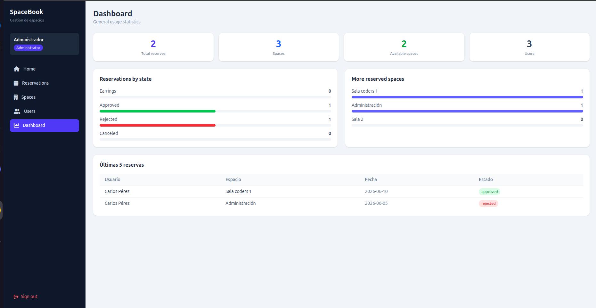

<p align="center">
  
  
  
  
  
</p>

# SpaceBook — Workspace Reservation SPA

<p align="center">
  
</p>

A Single Page Application for managing workspace reservations within a company. Built with Vanilla JavaScript + Vite + TailwindCSS, consuming a REST API simulated with json-server.

---

## Description

SpaceBook allows employees to reserve shared workspaces (meeting rooms, private offices, coworking areas, auditoriums) and enables administrators to manage all reservations, spaces, and users from a centralized dashboard.

---

## Technologies Used

- **Vite** — build tool and dev server
- **Vanilla JavaScript (ES Modules)** — no framework
- **TailwindCSS v4** — utility-first styling
- **json-server** — mock REST API
- **concurrently** — run Vite and json-server simultaneously

---

## Installation

Clone the repository

```bash
git clone https://github.com/Zerik-Official/Performance-Test-JavaScript
cd Performance-Test-JavaScript
```

Install dependencies

```bash
npm install
```

---

## Running the Project

```bash
npm run dev
```

This command starts both the Vite dev server (`http://localhost:5173`) and json-server (`http://localhost:3001`) concurrently.

---

## Running json-server Only

```bash
npx json-server --watch db.json --port 3001
```

---

## Test Users

| Name            | Email            | Password  | Role  |
|-----------------|------------------|-----------|-------|
| Administrador   | admin@test.com   | Admin123* | admin |
| Carlos Pérez    | carlos@riwi.com    | Carlos123*  | user  |
| Ana Gómez       | ana@riwi.com   | Ana123*  | user  |

---

## Project Structure

```
src/
├── api/
│   └── http.js                  # Base HTTP client (fetch wrapper)
├── components/
│   ├── formsBadgeds.js          # Reusable badged component
│   ├── Modal.js                 # Reusable modal component
│   ├── ReservationCard.js       # Reservation card with role-based actions
│   └── Sidebar.js               # Navigation sidebar
├── controllers/
│   ├── login.controller.js      # Authentication logic
│   ├── home.controller.js       # Home page stats and recent reservations
│   ├── reservations.controller.js # CRUD, filters, pagination, conflict check
│   ├── spaces.controller.js     # Spaces CRUD (admin only)
│   ├── users.controller.js      # Users listing (admin only)
│   └── dashboard.controller.js  # Usage statistics (admin only)
├── router/
│   └── router.js                # Hash-free SPA router with auth + role guards
├── services/
│   ├── reservation.service.js   # Reservation API calls
│   ├── space.service.js         # Space API calls
│   └── user.service.js          # User API calls
├── utils/
│   └── utils.js                 # Session helpers, toast, formatters, auth helpers
├── views/
│   ├── loginView.js
│   ├── homeView.js
│   ├── reservationsView.js
│   ├── spacesView.js
│   ├── usersView.js
│   ├── dashboardView.js
│   └── notFound.js
├── main.js                      # Entry point
└── style.css                    # Tailwind import
```

---

## Role Permissions

| Feature                      | Admin | User |
|------------------------------|-------|------|
| View all reservations        | ✅    | ❌   |
| View own reservations        | ✅    | ✅   |
| Create reservations          | ✅    | ✅   |
| Edit pending reservations    | ✅    | ✅ (own) |
| Approve / Reject reservations| ✅    | ❌   |
| Cancel approved reservations | ✅    | ✅ (own) |
| Delete reservations          | ✅    | ❌   |
| Manage spaces (CRUD)         | ✅    | ❌   |
| View all users               | ✅    | ❌   |
| View dashboard statistics    | ✅    | ❌   |

---

## Technical Decisions

- **History API routing** (`pushState`) instead of hash routing for cleaner URLs. Auth and role guards are applied inside the `router()` function on every navigation event.
- **Modular architecture**: each concern is isolated into views (HTML templates), controllers (event handlers + logic), services (API calls), and components (reusable UI).
- **Session persistence** via `localStorage`. The session stores only `id`, `name`, `role`, and `email` — no password.
- **Conflict detection** on the client side before submitting a new reservation: checks for overlapping time ranges on the same space and date, excluding cancelled/rejected reservations.
- **Toast notifications** implemented as a lightweight DOM utility (`showToast`) without external dependencies.
- **Pagination** implemented client-side after filtering, with `PAGE_SIZE = 6` per page.
- **Bug in base project**: `home.controller.js` called `getReservations` but `reservation.service.js` only exported `getReservation` (no `s`). Fixed by adding the correct export and updating the import.

---

## Bonus Features Implemented

- Passwords are hashed and upon logging in, they are re-hashed and compared.
- Dashboard with usage statistics and bar charts (CSS-based)
- Toast notifications
- Reservation search by space name, reason, or user
- Date filter for reservations
- Status filter for reservations
- Pagination (6 items per page)
- Spaces management module (admin only, linked to reservations)
- Users listing (admin only)
- Font awesome icons